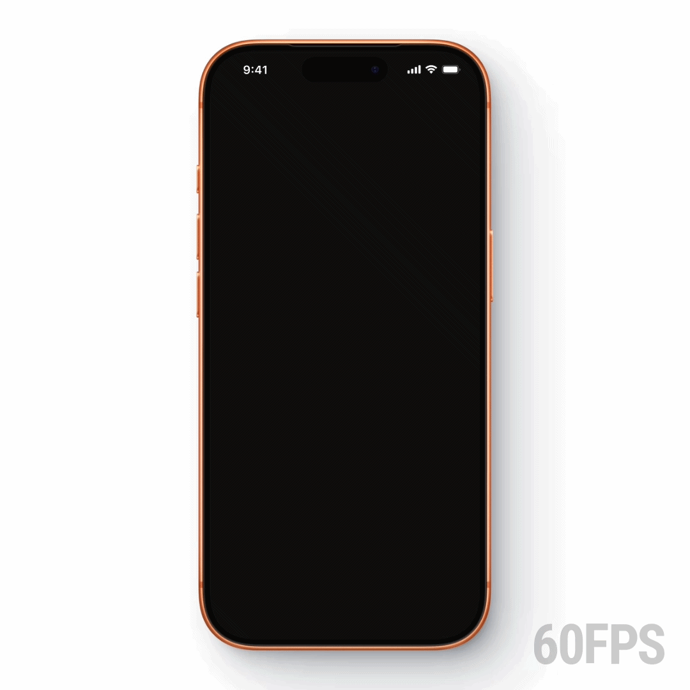

# Threads Logo Animation

A Flutter splash screen that hand-draws the Threads logo stroke by stroke, then fades away to reveal your app.

<br/>

<p align="center">
  
</p>

<br/>

---

## How it works

Everything lives in two files: `lib/splash.dart` (the animation) and `lib/main.dart` (the entry point). No packages, no assets, just Flutter's canvas.

### 1. The controller

A single `AnimationController` runs for 2 seconds. Two `TweenSequence` animations are derived from it:

```dart
_draw = TweenSequence<double>([
  TweenSequenceItem(
    tween: Tween(begin: 0.0, end: 1.0)
        .chain(CurveTween(curve: Curves.easeInOut)),
    weight: 80,  // first 80% of duration: draw the logo
  ),
  TweenSequenceItem(tween: ConstantTween(1.0), weight: 20),
]).animate(_ctrl);

_overlayFade = TweenSequence<double>([
  TweenSequenceItem(tween: ConstantTween(1.0), weight: 85),
  TweenSequenceItem(
    tween: Tween(begin: 1.0, end: 0.0)
        .chain(CurveTween(curve: Curves.easeIn)),
    weight: 15,  // last 15% of duration: fade the overlay out
  ),
]).animate(_ctrl);
```

The drawing finishes before the fade starts, the logo is always fully visible for a moment before disappearing.

### 2. Two separate paths

The logo is split into an **outer path** (the spiral body) and a **inner path** (the dot). They're drawn sequentially — the inner dot only starts once the outer stroke is 100% complete.

```dart
final drawn = draw * total;          // total length in logical pixels

final drawOuter = drawn.clamp(0.0, lenOuter);
// ... draw outer stroke up to `drawOuter`

if (drawn > lenOuter) {
  final drawInner = (drawn - lenOuter).clamp(0.0, lenInner);
  // ... draw inner dot
}
```

### 3. Path metrics for stroke-drawing

Flutter's `PathMetrics` API lets you extract a sub-segment of any path by length. This is the core trick that makes the "drawing" effect work:

```dart
for (final metric in _outerMetrics!) {
  final take = remaining.clamp(0.0, metric.length);
  if (take > 0) canvas.drawPath(metric.extractPath(0, take), paint);
  remaining -= take;
  if (remaining <= 0) break;
}
```

Path metrics are computed once and cached as static fields, so there's no per-frame reallocation.

### 4. The painter clips to the fill shape

The stroke width is intentionally wide (30 logical units). To keep it inside the logo silhouette rather than bleeding outside, the canvas is clipped to `_logoFillPath` before any drawing happens:

```dart
canvas.save();
canvas.scale(scaleX, scaleY);
canvas.clipPath(_logoFillPath);   // mask to logo shape
// ... draw strokes
canvas.restore();
```

The fill path uses `PathFillType.evenOdd`, which correctly handles the hole in the center of the logo.

### 5. Wrapping your app

`SplashView` wraps any widget. Once the animation completes it replaces itself with `child` directly — no routes, no `Navigator`:

```dart
if (_done) return widget.child;

return Stack(
  children: [
    widget.child,           // your app renders underneath
    AnimatedBuilder(
      animation: _ctrl,
      builder: (_, __) => Opacity(
        opacity: _overlayFade.value,
        child: ColoredBox(
          color: Colors.black,
          child: Center(child: CustomPaint(...)),
        ),
      ),
    ),
  ],
);
```

---

## Getting started

```bash
git clone https://github.com/junaidjamel/threads_logo_animation.git
cd threads_logo_animation
flutter pub get
flutter run
```

---

## License

This project is licensed under the [MIT License](LICENSE).

---

## Author

**Junaid Jamel**  
[GitHub](https://github.com/junaidjamel) · [LinkedIn](https://www.linkedin.com/in/junaid-jamel/)
